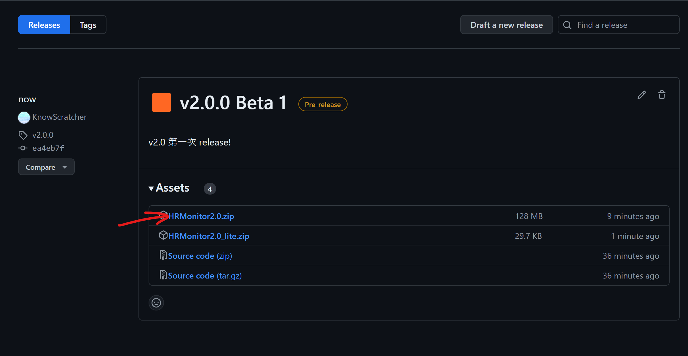
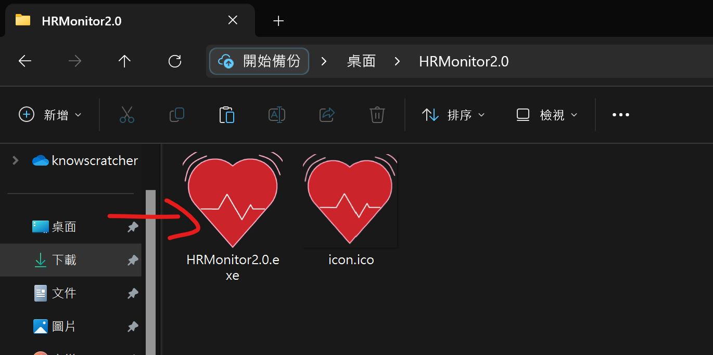
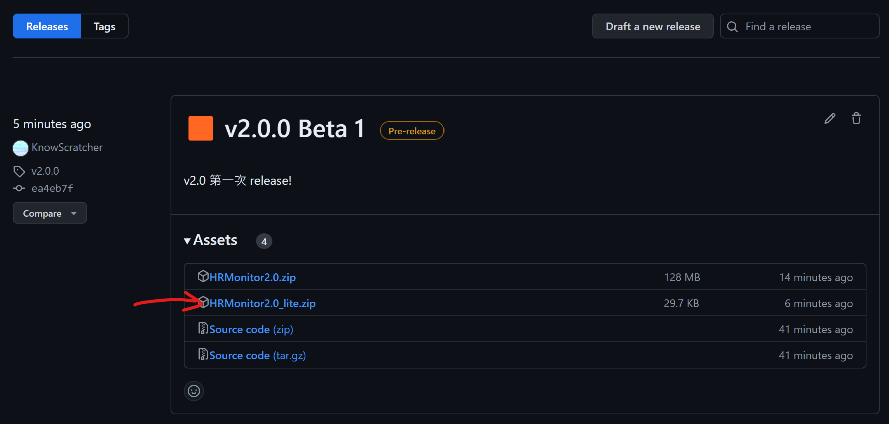

# 使用方式
## 沒有Python
1. 到[Release](./releases)下載最新版(128MB)

2. 解壓縮並執行exe檔

## 有Python
1. 到[Release](./releases)下載最新版**lite**(29.7KB)

2. 解壓縮並執行setup.bat

3. 執行main.py

⚠️請注意:**使用lite可能不會節省硬碟空間**⚠️

# 常見問題
## 我的exe被防毒攔下來
沒事的，我們可以保證裡面一隻病毒都沒有，所以你可以
- 關閉防毒軟體 或 建立防毒例外
- 下載Python然後用[lite版](./#有Python)

# 時間紀錄
Know Scratcher 

# 共寫更新
最新版本請寫在最上面

# 24/6/22 更新進度
`Know Scratcher` `version 20S0 : 2.0 Stable 0`
- Main
  - Reframe
  - Add realtime display
  - Fix window size
  - Rewrite analyzing method

# 24/6/11 更新進度
`JT Lin` `version 13S4 : 1.3 Stable 4`
- Main
  - Fixed some bug. (deleted line 133)
  - Updated output. (Line 132)

# 24/5/31 更新進度
`Kai & JT Lin` `version 13S3 : 1.3 Stable 3`
- Main
  - 合併 [13US2](https://github.com/nKiux/Bio-HRMonitor/blob/algo/main.py) 算法數據寫入
- Litxtre (LightEngine_Extreme)
  - 結合比對三算法並繪製曲線
  - 修復 [13US2](https://github.com/nKiux/Bio-HRMonitor/blob/algo/kernel_Litxtre.py) 內Bug
  - 分析三算法結果並輸出

# 24/5/28 更新進度
`Kai` `version 13US1 : 1.3 Unstable 1`
- Main
  - 開啟時重設自動亮度
  - DMX3.3
    - 移除自動鎖定亮度
  - 修改空條件式
- Kernel_LightEngine >> Litxtre (LightEngine Extreme)
  - 結合比對 Main函式與新平均算法
  - 若結果超過12 BPM輸出不準確通知

# 24/5/21 更新進度
`Kai` `version v1.3.3 : unstable`
- DMX3.2
  - 減少重複設定自動曝光次數

`Kai` `version v1.3.2 : Stable Release / 1.3.2`
- DMX3.1
  - 改進效能
- Kernel
  - 建立def準備合併算法
  - 下一個版本合併 Kernel_Litxtre (Light Extreme)

# 24/4/30 更新進度
`Kai` `version v1.3 : Stable Release / 1.3`
- DMX3
  - 架構改進
  - 視窗移動後重設計時與數據
  - 修改錯誤偵測輸出
  - 改善數據蒐集穩定性
  

# 24/4/23 更新進度
`Kai` `version v1.2 : Unstable Release / 1.2 FstR`

`1.2 HotFix`
- Main
  - 更新自動曝光原則

- Kernel_LightEngine
  - 算法更新.減少數據頭尾被忽視問題
  - 移除`Benchmark`
- UI_Beta_2
  - 更新UI.減少操作與更新顯示訊息
- Main
  - 移除`Benchmark`
  - 更新鎖定曝光優化
# 24/4/7 更新進度
`Kai`
`version v1.1 : Stable Release / 1.1`
- Kernel_LightEngine
  - 更新穩定性算法
  - 於非運動心律`(55~100 BPM)` 準確率可達96%以上

# 24/3/21 更新進度
`Kai`
`UI Py >> C# Prepare`
僅預上傳示範執行檔

# 第一版本釋出
`里程碑`
### 包含前述所有更新

v1.0備註：
測試60~80BPM之間
結果準確度僅約90+%，請勿用做醫療參考

# 24/3/11 更新進度
`JT_0`
`Merged >> v1.0 Release`
- Main
  - import `scipy.signal` (Line 5)
  - 新增全域陣列 `peak_index_global`，存取 `peak` 的 index 值。 (Line 12)
  - 註解舊版本 `D_speed`。 (Line 113~121)
  - 新增 `h_std` 高度標準。 (Line 131)
  - 更改 `bright_fixed` data type。 (Line 175~179)
  - 偵測到手指且 `counting >= 10` 才會開始做寫入數據及之後操作。 (Line 208)
  - 修改經過 15 秒後所做的操作 (Line 213~217)
    - 將 `counting >= 10` 移至 Line 208
    - 到此時才開始做數據分析並寫入結果
  - 寫入 `h_std` 數據。 (Line 225)
  - 註解舊偵測呼叫模式。 (Line 227~241)
  - 修改輸出。 (Line 248)
  - 新心律偵測函式 (Line 283~296)
- Kernel
  - 修改折線圖呈現資料，改為使用原始數據。 (Line 57~58)
  - 加入 `peak`。 (Line 60)
  - 新增折線圖標題、軸標題、`peak` 點。 (Line 63~68)
  - 清空明暗資料。 (Line 72~75)

`Kai`
`version v0.9.1 : Before Release / branch 1`
- UI_Beta2
  - 修正無法啟動
- Runner
  - 修正輸出
- Requirements
  - 修正輸出

# 24/3/10 更新進度
`Kai`
`version v0.9 : Before Release / branch 1`
- Kernel
  - 新增較穩定的心率監測
  - 經 *40+* 筆資料統計，準確度約90%
- Main
  - 移除測試模式選擇
  - 移除舊算法
  - 移除**win32gui**模組
  - 調整手指偵測
  - 手指偵測評分大於10時開始記錄
  - 修改終端機輸出
  - DMX原則調整
- UI_Beta2
  - 顯示正確心率
- Requirements
  - 啟動時安裝包含所需的所有module
- Runner
  - 啟動該啟動的啟動程式

# 24/03/07 更新進度
`Kai`
`version v0.6.8 (Kernel : visualize)`
- Kernel
  - 新增matplotlib將成果作圖

# 24/03/05 更新進度
`JT_0 & Kai`
`version v0.6.7 (Main Update), v0.6.7b (Optimize)`
**v0.6.7b**
- Main
  - 縮減219行~後面幾行

**v0.6.7**
- Main
  - 刪除多餘變數:
    - `beats`
    - `bright_rec`
    - `blank`
    - `avgAlp` (Line 158)
  - 未偵測到手指時，`beats`, `bpm` 設為 0。 (Line 198, 199)
  - 手指放上鏡頭過 15 秒且 `counting`(score) >= 10 時即 return False。 (Line 208~210)
  - 記錄亮度值 `with open()` 區塊整合進同一個 if 判斷式，且更改 `HR_monitor()` 呼叫方式。 (Line 212~229)
  - 修改未偵測到手指時寫入資料的字元。 (Line 241)
  - 修改終端機輸出。 (Line 246)
  - 修改 `HR_monitor()` 函式架構。 (Line 290~316)

# 24/03/04 更新進度
`Kai`
`version v0.6.6 (DynaMark 2iP)`
- UI_Beta2
  - 開啟時關閉Benchmark按鈕避免誤觸導致程式崩潰
- Main
  - ~~關閉`WaitKey`避免拖動視窗時影響效能~~ (取消更動)
  - 移除不必要影像處理，加速運行效率
  - 新增win32gui應用於DMX2iP
  - 拖動/縮放視窗自動停用DMX
  - 使用新函式分開定義DMX (部分不在函式內)

## DynaMarkX 2iP (intelligent / Precise)
 - 新增偵測分數，當 **連續低更新率** 出現時才會自動關閉cv2
 - 新增視窗拖動偵測，自動停用DMX
 - 更新def區隔程式

# 24/03/02 更新進度
`JT_0`
`version v0.6.5 (Main : Terminal!)`
- Main
  - 更新終端機輸出模式，使用 f 字串 (Line 214)

# 24/03/01 更新進度
`Kai`
`version v0.6.4 (Light Engine : DynaMarkX i)`
- Kernel
  - `DynaMarkX i`再次縮減啟動所需時間 (相較DMX減少80%以上啟動時間)
  - 修正cv2無法正常關閉Bug
- UI_Beta2
  - 移除`快速啟動` (註：目前開啟速度與`快速啟動`相同)
  - `快速啟動`改為`略過動態效能追蹤` (註：對效能影響極小，僅在啟動問題時開啟)
- Main
  - 開啟`自動曝光`
  - 新增DMXi進行`動態效能追蹤`
  - DMX現在目標更新率為5FPS(原為10FPS)
## DynaMarkX i (intelligent)
- 新增偵測閥，僅在幀間時間超過限定次數後強制關閉
- 新增DMX開關，可在啟動前控制開閉

# 24/02/29 更新進度
`Kai`
`version v0.6.3 (Light Engine : DynaMarkX!)`
- UI_Beta2
  - 修復Benchmark呼叫失敗Bug
- main
  - 修復模式選擇Bug
  - 新增DynaMarkX
- Kernel
  - 縮減啟動所需步驟
## 隆重介紹：DynaMarkX!
在安全啟動下減少60%以上的啟動時間！ (完整啟動，即未開啟`KernelSpeedUP!`)

透過**動態追蹤每一幀所花費的時間**進行判斷電腦效能是否符合需求

若偵測到效能問題則自動停止偵測

目前`DynaMarkX`可允許的最小更新速度為10FPS

`註：在開啟KernelSpeedUP的情況下仍會執行DMX`

# 24/02/28 更新進度
`Kai`
`version v0.6.2(Light Engine : UI Update!)`
- Kernel
  - 新增`模式選擇`
  - 改進開啟前清空檔案方式，空白檔案由第一行開始
  - 相機啟動失敗回傳`False`
- UI_Beta2
  - 新增模式變數
  - 重新設計UI
  - 新增`相機選擇`轉盤(及函式)
  - 新增`模式選擇`轉盤(及函式)
  - `Result`於相機失敗時顯示相關訊息
  - 新增`測試結束BPM顯示`，由`result.txt`讀取
- main
  - 若相機失敗回傳`False`
  - 新增`模式轉譯`，減少架構改變
  - 將BPM即時寫入`result.txt`，結束後轉交給UI輸出(UI_Beta2更新第6點) (註：需要算法配合，請於設定時間測試結束後將OpenCV結束，以便輸出)
  - 新增`模式選擇即時輸出`

- 舊UI

- 新UI

`Kai`
`vesion v0.6.1(HotFix)`
- Kernel
  - 更新`FPS檢查`測試方式，避免除以0的情況發生
- UI_Beta2
  - 更新按鍵操作機制，避免重複點擊出現Bug

# 24/02/27 更新進度

`JT_0`
`version v0.6(Light Engine : Algorithm)`
- Main
  - 加入 `time` 函式庫。 (Line 4)
  - `benchmark()` 函式為舊版本，本次更新只對 `start()` 做更新。
  - 更改手指偵測的判斷方式。 (Line 156, 160)
  - 加入紀錄亮度值的陣列 `bright_rec`，紀錄的為 `bright` (浮點數, A)。 (Line 176)
  - 加入 `passed`，使用於時間計算。 (Line 177)
  - 修改終端機輸出方式，改為刷新，但未來需更改。 (Line 211)
  - 算法
    - 新增算法及心跳偵測。 (Line 190~207)
    - 新增 `HR_monitor()`心跳偵測函式。 (Line 219~251)

# 
`Kai`
`version v0.5.1(Light Engine : Performance Check)`
- Kernel
  - `Fast Start`設定為`False`時，自動**新增**與 **!清空!** `Test.txt`存放亮度資料
- main
  - `Benchmark`內新增`FPS檢查`，檢查完畢的FPS數據將於終端機輸出以及存至`FPS`變數
  - 將亮度資料寫入`Test.txt` (僅在Finger_Detect = True時進行寫入，手離開後自動清空)

# 24/02/24 更新進度
`Kai`
`version v0.5.0(Light Engine : NewUI!)`
- Kernel
  - 修改為**以函式啟動**，由`UI_Beta2`開啟
  - 將**效能測試**與**正規啟動**分開宣告
  - 新增 `cv2.destroyAllWindows()` 正確關閉cv2視窗
- Main
  - 30行新增 `cv2.destroyAllWindows()`
  - 31行新增 `exit()`
- UI_Beta2
  - 使用**PyQt5**
  - **啟動主程式**
  - 基礎UI設計
  - `Start`連接至`kernel_LightEngine.start`
  - `Benchmark`連接至`kernel_LightEngine.pure_benchmark`
  - `Result`顯示`Benchmark`結果
  - `Fast Start`勾選框控制**快速啟動開關**
  - *`BPM`待接入*
 
`備註：目前相機只能使用相機0，需要自行在kernel_LightEngine和UI_Beta2內進行修改`

# 24/02/21 更新進度
`Kai`
`no version has been updated.`
- Kernel
  - 移除**舊Kernel**

# 24/02/20 更新進度
`Kai`
`version v0.4.3(Light Engine : FiX!)`
- Kernel
  - 修復 **程式無法運作**
  - 新增一些註解
  - 移除 **舊相機控制方法**
  - 移除 **Kernel** 的性能測試選項，若未開啟 **Kernel SpeedUP!** 將會自動執行 **Benchmark**
- Main
  - 移除 **舊相機控制方法**
  - 移除 **舊馬賽克方法**
#
`Kai`
`version v0.4.2(Light Engine : Cam_Beta)`
- Kernel
  - 新增**性能測試**至啟動 `若未通過性能測試則程式自動關閉`
  - 若**快速啟動**為`False`且**性能測試**為`False`，則程式將不會運作(bug，將會修復)
- Main
  - **性能測試**將不會開啟相機預覽 `減少非必要閃爍與開啟視窗`
  - 新增**所有webcam通用控制項**，需要自行下載插件放入與程式相同資料夾 `控制相機參數確保可以運作`
- cam_sett.cfg
  - 新增相機控制項
  - [cfg_cam下載](https://github.com/SuslikV/cfg-cam)
  - 將此程式與`cam_sett.cfg`放入與Main, kernel_LightEngine相同資料夾

# 24/02/18 更新進度
`Kai`
`version v0.4.1 (Light Engine : SPD)`
- Kernel
  - 新增**性能測試** `統計10次計算共花時間(需在3秒內完成) 並顯示測試成果`
  - 新增**Kernel_speedup!** `略過啟動部分項目，共減少約50%啟動時間`
- Main
  - 拆分**Kernel**檔案至**Main** `加強易讀性`
  - 新增**benchmark** `使用簡易算法，配合上述說明使用`

# 24/02/15 更新進度
`Kai`
`version v0.4 (Light Engine : Initial)`
- Kernel
  - 新增**確信度評分** `等待10次update才開始進行校準`
  - 新增**自動校準** `每30次偵測到手指的update自動重設平均亮度最大值與最小值`
  - 新增**重新設定解析度** `統一偵測的畫面長寬`
  - 修改**降噪算法** `使用單色與模糊進行畫面模擬，更易觀察亮度變化`
  - 關閉**馬賽克降噪** `此方法已不再適用`

# 24/02/10 更新進度
`Kai`
`version v0.3.1`
- Kernel
  - 新增牛逼進度條

# 24/02/09 更新進度
`Kai`
`version v0.3`
- Kernel
  - 新增除錯訊息
  - 相機曝光鎖定
  - 相機對比鎖定
  - 相機銳利度鎖定 (未確認此項功能正常運作)
  - 開啟前檢測cv2
  - 開啟前相機設定與檢測
  - 馬賽克尺寸重新調整
- 需改進
  - 相機降噪算法
  - 是否移動至開發手機app (電腦平台感光元件實在是太小，無法捕捉細微脈搏)

# 24/02/08 更新進度
`Kai`
`version v0.2`
- Kernel  
  - 手指偵測
  - 馬賽克
  - 相機開啟
  - R、G、B、Brightness 平均值計算

- 需要改進
  - 相機降噪算法
  - 算法
